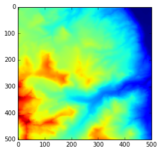
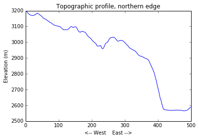
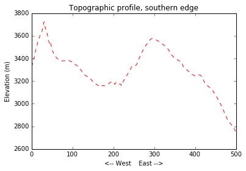
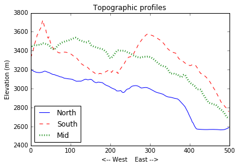

> ## Learning Objectives {.objectives}
>
> *   Explain what a library is, and what libraries are used for
> *   Load a Python library and use the tools it contains
> *   Read data from a file into a program
> *   Assign values to variables
> *   Select individual values and subsections from data
> *   Perform operations on arrays of data
> *   Display simple graphs

While a lot of powerful tools are built into languages like Python,
even more tools exist in [libraries](reference.html#library).

In order to load the elevation data,
we need to [import](reference.html#import) a library called NumPy.
You should use this library if you want to do fancy things with numbers (ie. math),
especially if you have matrices or arrays.
We can load NumPy using:

~~~ {.python}
import numpy
~~~

Importing a library is like pulling a toolbox out of a
storage locker and placing it on your workbench, making everything inside the toolbox accessible. Python has a set of built-in functions that are always available (the tools you always have available) and libraries provide
additional functionality (the specialized tools in the toolbox you only sometimes need).

Once we’ve loaded the library, we can
call a function inside that library to read the data file:

~~~ {.python}
numpy.loadtxt('data/topo.asc', delimiter=',')
~~~
~~~ {.output}
array([[ 3198.8391,  3198.123 ,  3197.1584, ...,  2583.3293, 
    2585.4368, 2589.1079], [ 3198.3306,  3197.5242,  3196.4102, ..., 
    2582.6992,  2584.9167, 2587.801 ], [ 3197.9968,  3196.9197, 
    3195.7188, ...,  2581.8328,  2583.8159, 2586.0325], ..., [
    3325.1509,  3334.7822,  3343.3154, ...,  2780.8191,  2769.3235,
    2762.373 ], [ 3325.0823,  3335.0308,  3345.4963, ...,  2775.3345, 
    2765.7131, 2759.6555], [ 3326.6824,  3336.5305,  3348.1343, ..., 
    2769.7661,  2762.5242, 2756.6877]])
~~~

The expression `numpy.loadtxt(...)` is a [function call](reference.html#function-call)
that asks Python to run the function `loadtxt` that belongs to the `numpy` library.
This [dotted notation](reference.html#dotted-notation), with the syntax `thing.component`, is used
everywhere in Python to refer to parts of things.

The function call to `numpy.loadtxt` has two [parameters](reference.html#parameter):
the name of the file we want to read,
and the [delimiter](reference.html#delimiter) that separates values on a line.
Both need to be character strings (or [strings](reference.html#string), for short)
so we write them in quotes.

Within the Jupyter (iPython) notebook, pressing Shift+Enter runs the
commands in the selected cell. Because we haven't told iPython what to
do with the output of `numpy.loadtxt`, the notebook just displays it on
the screen. In this case, that output is the data we just loaded. By
default, only a few rows and columns are shown (with `...` to omit
elements when displaying big arrays).

Our call to `numpy.loadtxt` read the file but didn’t save it to memory.
In order to access the data, we need to [assign](reference.html#assignment) the values to a [variable](reference.html#variable).
A variable is just a name that refers to an object. Python’s variables
must begin with a letter and are [case sensitive](reference.html#case-sensitive). We can assign a
variable name to an object using `=`.

>## Objects and their names {.callout}
>
>What happens when a function is called but the output is not assigned to
>a variable is a bit more complicated than simply not saving it. The call
>to `numpy.loadtxt` read the file and created an object in memory that
>contains the data, but because we didn't assign it to a variable name,
>there is no way for us to call this object. While this difference might
>seem irrelevant (and, in practice, it probably is), it will be important to
>consider how variable names are assigned to objects when we talk about
>mutable and immutable objects later on.
>
>A good explanation of how Python handles variables and objects can be
> found [in Jeff Knupp's blog](https://jeffknupp.com/blog/2012/11/13/is-python-callbyvalue-or-callbyreference-neither/).

Let’s re-run numpy.loadtxt and assign the output to a variable name:

~~~ {.python}
topo = numpy.loadtxt('data/topo.asc', delimiter=',')
~~~

This command doesn’t produce any visible output. If we want to see the
data, we can print the variable’s value with the command `print`:

~~~ {.python}
print topo
~~~

~~~ {.output}
    [[ 3198.8391  3198.123   3197.1584 ...,  2583.3293  2585.4368 
    2589.1079] [ 3198.3306  3197.5242  3196.4102 ...,  2582.6992 
    2584.9167  2587.801 ] [ 3197.9968  3196.9197  3195.7188 ..., 
    2581.8328  2583.8159  2586.0325] ..., [ 3325.1509  3334.7822 
    3343.3154 ...,  2780.8191  2769.3235  2762.373 ] [ 3325.0823 
    3335.0308  3345.4963 ...,  2775.3345  2765.7131  2759.6555] [
    3326.6824  3336.5305  3348.1343 ...,  2769.7661  2762.5242 
    2756.6877]]
~~~

> ## Check your understanding {.challenge}
>
> Track how variable names and values are connected after each statement in the following program:
>
> ~~~ {.python}
> mass = 47.5
> age = 122
> mass = mass * 2.0
> age = age - 20
> ~~~

> ## Sorting out references {.challenge}
>
> What does the following program print out?
>
> ~~~ {.python}
> first, second = 'Grace', 'Hopper'
> third, fourth = second, first
> print third, fourth
> ~~~

Using its variable name, we can see that [type](reference.html#type) of object the variable name `topo` is assigned 
to:

~~~ {.python}
print type(topo)
~~~

~~~ {.output}
    <type 'numpy.ndarray'>
~~~

The function `type` tells us that the variable name `topo` currently
points to an N-dimensional array created by the NumPy library. We can also get the shape of the
array:

~~~ {.python}
print topo.shape
~~~

~~~ {.output}
(500, 500)
~~~

This tells us that `topo` has 500 rows and 500 columns. The file
we imported contains elevation data (in meters, 2 degree spacing) for an
area along the Front Range of Colorado, so the area that this array represents is 1 km x 1 km.

The object of
type `numpy.ndarray` that the variable `topo` is assigned to contains the values of the array
as well as some extra information about the array. These are the [members](reference.html#member) or attributes of the object, and they
describe the data in the same way an adjective describes a noun. The
command `topo.shape` calls the `shape` attribute of the object with the variable name
`topo` that describes its dimensions. We use the same dotted notation
for the attributes of objects that we use for the functions inside
libraries because they have the same part-and-whole relationship.

>## len() and other built-in functions {.callout}
>
>The function `len()` returns the length of the longest axis of a
>sequence (a numpy array, a list, etc.). Because it is a built-in
>function, it is always available for the Python interpreter and doesn't
>have to be imported. The function `type()` is another built in function.
>You can read about them in the [Python docs](https://docs.python.org/2/library/functions.html).

> ## Who's who in the memory {.callout}
>
> You can use the whos command at any time to see what variables you have
> created and what modules you have loaded into the computers memory. As
> this is an IPython command, it will only work if you are in an iPython
> terminal or the Jupyter Notebook.
>
> ~~~ {.python}
> whos
> ~~~
> ~~~ {.output}
> Variable    Type       Data/Info
> --------------------------------
> numpy       module     <module 'numpy' from '/Us<...>kages/numpy/__init__.py'>
> topo		  ndarray    500x500:250000 elems, type `float64`, 2000000 bytes (1 Mb)
> ~~~

## Plotting
 
Rasters are just big two dimensional arrays of values. In the case of DEMs, those values
are elevations. It's very hard to get a good sense of what this landscape
looks like by looking directly at the data. This information is better
conveyed through plots and graphics.

Data visualization deserves an entire lecture (or course) of its own,
but we can explore a few features of Python's `matplotlib` library here.
While there is no "official" plotting library in Python, this package is
the de facto standard.

We start by importing the `pyplot` module from the library `matplotlib`:

~~~{.python}
import matplotlib.pyplot
~~~

> ## Some IPython magic {.callout}
> 
> If you're using an IPython / Jupyter notebook, you'll need to execute
> the following command in order for the plots to appear in
> the notebook instead of a separate window:
> 
> ~~~{.python}
> %matplotlib inline
> ~~~
> 
> The `%` indicates an IPython magic function - a function that is only
> valid within the notebook environment. Note that you only have to
> execute this function once per notebook.

We can use the function `imshow` within `matplotlib.pyplot` to display arrays as a 2D
image:

~~~{.python}
matplotlib.pyplot.imshow(topo)
~~~

## Indexing

We can access individual values in an array using an [index](reference.html#index) in square brackets:

~~~ {.python}
print 'elevation at the corner of topo:', topo[0,0], 'meters'
~~~
~~~ {.output}
elevation at the corner of topo: 3198.8391 meters
~~~

~~~ {.python}
print 'elevation at some random point in topo:', topo[137,65],
'meters'
~~~
~~~ {.output}
elevation at some random spot in topo: 3251.1179 meters
~~~

When referring to entries in a two dimensional array, the indices are
ordered `[row,column]`. The expression `topo[137, 65]` should not surprise
you but `topo[0,0]` might. Programming languages like Fortran and MATLAB
start counting at 1 because that’s what (most) humans have done for
thousands of years. Languages in the C family (including C++, Java,
Perl, and Python) count from 0 because that’s simpler for computers to
do. So if we have an M×N array in Python, the indices go from 0 to M-1
on the first axis (rows) and 0 to N-1 on the second (columns). In
MATLAB, the same array (or matrix) would have indices that go from 1 to
M and 1 to N. Zero-based indexing takes a bit of getting used to, but
one way to remember the rule is that the index is how many steps we have
to take from the start to get to the item we want.

Python also allows for negative indices to refer to the position of
elements with respect to the end of each axis. An index of -1 refer to
the last item in a list, -2 is the second to last, and so on. Since
index `[0,0]` is the upper left corner of an array, index `[-1,-1]`
therefore the lower right corner of the array:

~~~{.python}
print topo[-1,-1]
~~~
~~~{.output}
2756.6877
~~~

> ## In the Corner {.callout}
>
> What may also surprise you is that when Python displays an array,
> it shows the element with index `[0, 0]` in the upper left corner
> rather than the lower left.
> This is consistent with the way mathematicians draw matrices,
> but different from the Cartesian coordinates.
> The indices are (row, column) instead of (column, row) for the same reason,
> which can be confusing when plotting data.

> ## Check your understanding {.challenge}
>
> Draw diagrams showing how variable names and values are connected after each statement in the following program:
>
> ~~~ {.python}
> mass = 47.5
> age = 122
> mass = mass * 2.0
> age = age - 20
> ~~~

> ## Sorting out references {.challenge}
>
> What does the following program print out?
>
> ~~~ {.python}
> first, second = 'Grace', 'Hopper'
> third, fourth = second, first
> print third, fourth
> ~~~

## Slicing

A command like `topo[0,0]` selects a single element in the array `topo`.
Indices can also be used to [slice](reference.html#slice) sections of the array. For example, we
can select the top left quarter of the array like this:

~~~ {.python}
print topo[0:5, 0:5]
~~~
~~~ {.output}
[[ 3198.8391  3198.123   3197.1584  3196.2017  3193.8813] [
    3198.3306  3197.5242  3196.4102  3194.7559  3191.9763] [ 3197.9968 
    3196.9197  3195.7188  3193.3855  3190.5371] [ 3198.054   3196.7031 
    3194.9573  3192.4451  3189.5288] [ 3198.3289  3196.9111  3195.335  
    3192.7874  3190.0085]]

~~~

The slice `[0:5]` means "Start at index 0 and go along the axis up to,
but not including, index 5".

We don’t need to include the upper or lower bound of the slice if we
want to go all the way to the edge. If we don’t include the lower bound,
Python uses 0 by default; if we don’t include the upper bound, the slice
runs to the end of the axis. If we don’t include either (i.e., if we
just use ‘:’), the slice includes everything:

~~~ {.python}
print topo[:len(topo)/2, len(topo)/2:]
~~~
~~~ {.output}
[[ 3008.1116  3012.2922  3015.3018 ...,  2583.3293  2585.4368 
    2589.1079] [ 3009.9558  3014.0007  3016.5647 ...,  2582.6992 
    2584.9167  2587.801 ] [ 3010.8604  3014.1228  3016.7412 ..., 
    2581.8328  2583.8159  2586.0325] ..., [ 3370.0918  3368.5371 
    3366.7148 ...,  2687.8396  2682.4326  2676.8521] [ 3370.478  
    3368.7561  3366.8923 ...,  2685.9941  2681.2888  2676.9924] [
    3371.2021  3369.3376  3367.3677 ...,  2687.7014  2685.5146 
    2683.1936]]
~~~

> ## Point elevations {.challenge}
> 
> Use indexing to answer the following questions and check your answers
> against the data visualization:
> 
> * Is the NW corner of the region higher than the SW corner? What's the
> elevation difference?
> * What's the elevation difference between the NE corner and the SE corner?
> * What's the elevation at the center of the region shown in the array?

> ## Slicing strings {.challenge}
>  
> Indexing and slicing behave the same way for any type of sequence,
> including numpy arrays, lists, and strings. Create a new variable called
> `text` and assign it the string "The quick brown fox jumped over the
> lazy dog." (note the capitalization and punctuation in each sentence, and include the quotes so Python recognizes it as a string).
> Then use slicing and the `print` statement to create these frases:
> 
> * the lazy dog.
> * The fox jumped over the dog
> * The lazy fox jumped over the quick brown dog.

> ## Plotting smaller regions {.challenge}
> 
> Use the function `imshow` from `matplotlib.pyplot` to make one plot
> showing the northern half of the region and another plot showing the southern
> half.
> 
> Then try making four separate plots showing each quarter of the region
> separately.

> ## Non-square arrays {.challenge}
>  
> We've been using `len(topo)/2` as both the row and column indices of the
> center point in the array `topo`. This doesn't work with an array that's
> not square (has different height and width).
> 
> * Take a (small) slice of the array `topo` and assign it to a new
> variable. Make this new array have a height longer than its width, and
> make both the height and width even numbers (4 x 6 is a good size).
> 
> * Access the center point of your new array. Write the indices using
> variables, not numbers (ie. don't write `t[2,3]`) (Hint: `topo.shape` gives the number of rows and columns in `topo`. The
> function `len(topo)` returns the length of the longest axis. Instead of
> using `len()`, assign the output of `shape` to a variable and use
> indexing). Are you *really* pointing to the center of your array? How
> far off are you?

> ## Odd-sized arrays {.challenge}
>  
> Both the array `topo` and the one you created above have even numbers of
> rows and columns. In that case, the output of `width/2` and `height/2` were both
> whole numbers (and therefore valid indices). *Mysteriously*,
> `len(topo)/2` would work as an index even if the array `topo` had odd
> numbers of rows and columns. Let's test it out!
> 
> * Take a second slice of `topo` that is one row and column larger
> than the one you made previously. Check its shape and print the value at
> the center of the array using indices like `width/2` and `height/2`.
> Does this work? *Should* this work?
> 
> * Compare the actual indices of the center point of this array and the
> indices you would calculate by dividing its width and height by 2. Is
> division in Python behaving like division in the real world? (Hint: If
> an array has a width and height that are odd numbers, what should the
> value of `width/2` be?).
> 
> * Test the behavior of division (using `/`) in Python by trying various
> even and odd whole numbers and decimals as both the nominator and
> denominator.

> ## Integers and floats {.callout}
>  
> In the real world, dividing an odd number by 2 results in a number with
> a decimal point (ie. half of 7 is 3.5). In Python, though, that's not always the case:
> 
> ~~~{.python}
> print '7/2 =', 7/2
> ~~~
> ~~~{.output}
> 7/2 = 3
> ~~~
> 
> In Python 2.x, dividing one whole number (the number 7) by another whole
> number (the number 2) always results in a whole number. If either number
> is a decimal, division behaves as expected and returns a decimal:
> 
> ~~~{.python}
> print '7.0000000001/2 =', 7.0000000001/2
> ~~~
> ~~~{.output}
> 7.0000000001/2 = 3.50000000005
> ~~~
> 
> For computers, integers (whole numbers) and floats (or floating point
> numbers, decimals) are object of different [type](reference.html#type)
> and sometimes behave differently:
> 
> ~~~{.python}
> print '7 is an integer:', type(7)
> print '7.0000000001 is a float:', type(7.0000000001)
> ~~~
> ~~~{.output}
> 7 is an integer: <type 'int'>
> 7.0000000001 is a float: <type 'float'>
> ~~~
> 
> While this might seem strange and unnecessarily annoying, some
> programming languages use integer division for historical reasons:
> integers take up less space in memory and integer operations were much
> faster on early machines. This behavior can easily introduce bugs into
> your code but it is actually useful in a lot of situations (Python 3.x
> does not use integer division by default but returns a float when
> appropriate).
> 
> Whole numbers are treated as floats if they have decimal point:
> 
> ~~~{.python}
> print '7 is', type(7)
> print '-' * 20
> print '7. is', type(7.)
> print '7.0 is', type(7.0)
> ~~~
> ~~~{.output}
> 7 is <type 'int'>
> --------------------
> 7. is <type 'float'>
> 7.0 is <type 'float'>
> ~~~
> 
> The integer assigned to a variable can be used as a float through
> **casting**:
> 
> ~~~{.python}
> type_int = 7
> type_float = float(type_int)
> 
> print 'type_int is', type(type_int)
> print 'float(type_int) is',
> type(type_float)
> ~~~
> ~~~{.output}
> type_int is <type 'int'>
> float(type_int) is <type 'float'>
> ~~~
> 
> Casting doesn't permanently change the value of the original object,
> though:
> 
> ~~~{.python}
> print 'type_int/2 =', type_int/2
> print 'float(type_int)/2 =', float(type_int)/2
> ~~~
> ~~~{.output}
> type_int/2 = 3
> float(type_int)/2 = 3.5
> ~~~ 
>     

## Numerical operations on arrays

We can perform basic mathematical operations on each individual element
of a NumPy array. We can create a new array with elevations in feet:

~~~{.python}
topo_in_feet = topo * 3.2808
print 'Elevation in meters:', topo[0,0]
print 'Elevation in feet:', topo_in_feet[0,0]
~~~
~~~{.output}
Elevation in meters: 3198.8391
Elevation in feet: 10494.7513193
~~~

Arrays of the same size can be used together in arithmatic operations:

~~~{.python}
double_topo = topo + topo
print 'Double topo:', double_topo[0,0], 'meters'
~~~
~~~{.output}
Double topo: 6397.6782 meters
~~~

We can also perform statistical operations on arrays:

~~~{.python}
print 'Mean elevation:', topo.mean(), 'meters'
~~~
~~~{.output}
Mean elevation: 3153.62166407 meters
~~~

> ## Methods vs. attributes {.callout}
> 
> `mean` is a method that belongs to the array `topo`, i.e., it is a
> function `topo` can inherently call just because of its type.
> When we call `topo.mean()`, we are asking `topo` to calculate its mean
> value. Because it is a function, we need to include parenthesis in the
> command. Because it is an `np.array`, `topo` also has an attribute called `shape`, but it doesn't include parenthesis because
> attributes are objects, not functions.
> 
> Python will kindly tell us if we mix up the parentheses:
> 
> ~~~{.python}
> topo.mean
> ~~~
> ~~~{.output}
> <function mean>
> ~~~
> 
> ~~~{.python}
> topo.shape()
> ~~~
> ~~~{.output}
> --------------------------------------------------------------------
> -------
> 
> TypeError                                 Traceback (most recent
> call last)
> 
> <ipython-input-29-5f3a6f1ecafc> in <module>() ----> 1 topo.shape()
> 
> TypeError: 'tuple' object is not callable
> ~~~

NumPy arrays have many other useful methods:

~~~{.python}
print 'Highest elevation:', topo.max(), 'meters'
print 'Lowest elevation:', topo.min(), 'meters' 
~~~

~~~{.output}
Highest elevation: 3831.2617 meters
Lowest elevation: 2565.0293 meters
~~~

We can also call methods on slices of the array:

~~~{.python}
half_len = int(len(topo) / 2)

print 'Highest elevation of NW quarter:', topo[:half_len,
:half_len].max(), 'meters'

print 'Highest elevation of SE quarter:', topo[half_len:,
half_len:].max(), 'meters' 
~~~

~~~{.output}
Highest elevation of NW quarter: 3600.709 meters
Highest elevation of SE quarter: 3575.3262 meters
~~~

Methods can also be used along individual axes (rows or columns) of an
array. If we want to see how the mean elevation changes with longitude
(E-W), we can use the method along `axis=0`:

~~~{.python}
print topo.mean(axis=0) 
~~~

To see how the mean elevation changes with latitude (N-S), we can use
`axis=1`:

~~~{.python}
print topo.mean(axis=1) 
~~~

## Plotting, take two
 
It's hard to get a sense of how the topography changes across the
landscape from these big tables of numbers. A simpler way to display
this information is with line plots.

We are again going to use the `matplotlib` package for data
visualization. Since we imported the `matplotlib.pyplot` library once
already, those tools are available and can be called within Python. As a
review, though, we are going to write every step needed to load and plot
the data.

We use the function `plot` to create two basic line plots of the
topography:

~~~{.python}
import numpy as np
import matplotlib.pyplot as plt
%matplotlib inline

topo = np.loadtxt('data/topo.asc', delimiter=',')

plt.plot(topo[0,:])
plt.title('Topographic profile, northern edge')
plt.ylabel('Elevation (m)')
plt.xlabel('<-- West    East -->')
plt.show()

plt.plot(topo[-1,:], 'r--')
plt.title('Topographic profile, southern edge')
plt.ylabel('Elevation (m)')
plt.xlabel('<-- West    East -->')
plt.show() 
~~~

> ## Scientists dislike typing {.callout}
>
> We will always use the syntax `import numpy` to import NumPy. However,
> in order to save typing, it is [often
> suggested](http://www.scipy.org/getting-started.html#an-example-script
> ) to make a shortcut like so: `import numpy as np`. If you ever see
> Python code using a NumPy function with `np` (for example,
> `np.loadtxt(...)`), it's because they've used this shortcut.

To better compare these profiles, we can plot them as separate lines in
a single figure using the argument `hold=True`, This will force all
subsequent calls to `plt.plot` to use the same axes (until it reaches
`plt.show()`). The argument `label=` holds the label that will appear in the legend.

~~~{.python}
import numpy as np import matplotlib.pyplot as plt
%matplotlib inline

topo = np.loadtxt('data/topo.asc', delimiter=',')

plt.plot(topo[0,:], hold=True, label='North')

plt.plot(topo[-1,:], 'r--', label='South')

plt.plot(topo[len(topo)/2,:], 'g:', linewidth=3, label='Mid')

plt.title('Topographic profiles')
plt.ylabel('Elevation (m)')
plt.xlabel('<-- West    East -->')
plt.legend(loc = 'lower left')

plt.show() 
~~~

> ## Make your own plots {.challenge}
>
> Create three separate plots showing how the maximum (`numpy.max()`),
> minimum (`numpy.min()`), and mean (`numpy.mean()`) elevation changes
> with longitude. Label the axes and include a title for each of the
> plots (Hint: use `axis=0`).
>
> Convert the separate plots into a single plot that includes all three
> statistics (using `hold=True`). Create a legend.

> ## Subplots {.challenge}
>
> We often want to arrange separate plots in layouts with multiple rows
> and columns. The script below uses subplots to show the elevation
> profile at the western edge, the mid longitude, and eastern edge of
> the region. Subplots can be a little weird because they require the
> axes to be defined before plotting. Type (don't copy-past!) the code
> below to get a sense of how it works.
> 
>This script uses a number of new commands. The function `plt.figure()`
>creates a space into which we will place the three plots. The parameter
>`figsize` tells Python how big to make this space. Each subplot is
>placed into the figure using the `subplot` command. The `subplot`
>command takes 3 parameters: the first denotes the total number of rows
>of subplots in the figure, the second is the total number of columns of
>subplots in the figure, and the final parameters identifies the
>position of the subplot in the grid. The axes of each subplot are
>called with different variable (axes1, axes2, axes3, axes4). Once a
>subplot is created, the axes can be labeled using the `set_xlabel()`
>(or `set_ylabel()`) method. `plt.show()` is called after the entire
>figure is set up.
>
>~~~{.python}
>import numpy as np import matplotlib.pyplot as plt
>%matplotlib inline
>
>topo = np.loadtxt('data/topo.asc', delimiter=',')
>
>fig = plt.figure(figsize=(16.0, 3.0))
>
>axes1 = fig.add_subplot(1,3,1)
>axes2 = fig.add_subplot(1,3,2)
>axes3 = fig.add_subplot(1,3,3)
>
>axes1.plot(topo[:,0])
>axes1.set_ylim([2500,3900])
>axes1.set_ylabel('Elevation (m)')
>axes1.set_xlabel('<-- N   S -->')
>axes1.set_title('West')
>
>axes2.plot(topo[:,len(topo)/2])
>axes2.set_ylim([2500,3900])
>axes2.set_xlabel('<-- N   S -->')
>axes2.set_title('Mid')
>
>axes3.plot(topo[:,-1])
>axes3.set_ylim([2500,3900])
>axes3.set_xlabel('<--N   S -->')
>axes3.set_title('East')
>
>plt.show(fig) 
>~~~

>## Subplots of DEMs {.challenge}
> 
>Make a 2x2 grid of subplots that use the function `imshow` to display
>each quarter of the dataset (ie. split down the middle in both x and y).
>
>* Don't label axes or add a colorbar. It can be tricky to do this with subplots.
>* To set the range of colors for one subplot, include the arguments `vmin` and `vmax`
>in `imshow` like this:
>
>~~~{.python}
>vmin = topo.min()
>vmax = topo.max()
>
>plt.imshow(topo, vmin=vmin, vmax=vmax) 
>~~~
