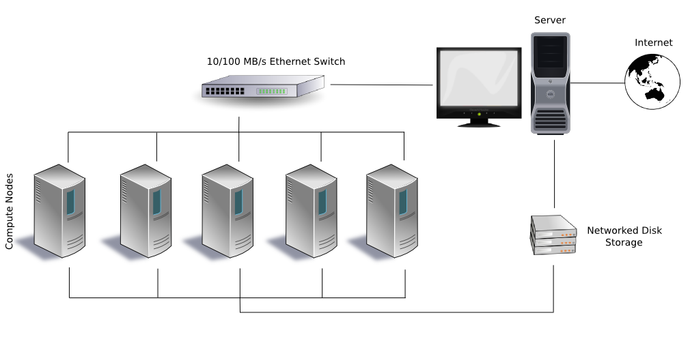

> ## Learning Objectives {.objectives}
>
> * Understand how a cluster differs from a desktop computer
> * Be able to submit a job to a queue and check its status

A cluster computer is a supercomputer
constructed from individual cheap, replaceable computers
(called [nodes](reference.html#node))
that are linked by a fast network.
Each node has its own operating system,
usually a Linux variant.
In a typical setup,
one of the nodes in the cluster
is configured as the [head node](reference.html#head-node),
which acts as the controller for the cluster.
The remainder of the nodes
are configured as [compute nodes](reference.html#compute-node).
Through the use of specially designed software,
the nodes of a cluster
act as a single computer.

A typical cluster is diagrammed here:

Note how the outside world can only communicate with the cluster
through the server
(i.e., the head node, in the terminology we're using);
the compute nodes are hidden.
The head node is linked to the compute nodes
through a local network.
The head node and the compute nodes may also share
a locally networked storage device.

> ## Head node use {.callout}
>
> The head node is only to be used for
>
> * cluster access
> * job scheduling
> * communication with the compute nodes
>
> Heavy computational use may cause the head node to become unresponsive,
> limiting its availability to outside users
> and impeding job monitoring.
> Always use [PBS](reference.html#portable-batch-system) commands (below)
> to perform computational work on a cluster.

<!-- About the CSDMS cluster -->

CSDMS maintains a cluster computer, ***beach***,
an SGI Altix XE1300 with 88 Altix XE320 compute nodes.
Each compute node is configured
with two quad-core 3.0 GHz E5472 (Harpertown) processors,
for a total of 704 cores.
Twenty-six of the 88 nodes have 4 GB of memory per core,
while the remainder have 2 GB of memory per core.
The cluster is controlled through an Altix XE250 head node.
Internode communication is accomplished through either gigabit ethernet
or over a non-blocking InfiniBand fabric.
Each compute node has 250 GB of local temporary storage.
All nodes are able to access 36 TB of RAID storage through NFS.

<!-- Working on a cluster -->

The typical way of working on a cluster
is to submit a [job](reference.html#job)
to the [scheduler](reference.html#scheduler)
that resides on the head node.
A job is organized as a script,
typically written in bash or in Python,
that contains commands to perform tasks.
If more than one job is scheduled,
they're assigned to a [queue](reference.html#job-queue) by the scheduler.
When adequate computing resources become available,
a job is popped off of the queue and run.
After the run completes,
any output can be collected
and transferred from the cluster
to a user's local computer.

<!-- PBS commands -->

The CSDMS cluster uses the
[TORQUE](http://www.adaptivecomputing.com/products/open-source/torque/)
job scheduler,
which employs [PBS](reference.html#Portable-Batch-System) commands
to submit and monitor jobs on the cluster.
Key PBS commands are:

* `qstat` to show the status of a job
* `qsub` to submit a job to the queue
* `qdel` to remove a job from the queue

Detailed information on these commands can be found
on their respective `man` pages; e.g.,

~~~ {.bash}
$ man qsub
~~~

<!-- Login to beach -->

To access the CSDMS cluster,
log into the head node of ***beach*** from your computer,
using the `ssh` ("secure shell") command:

~~~ {.bash}
$ ssh [username@]beach.colorado.edu
~~~

Be sure to replace `[username]` with the user name assigned to you
on ***beach***.
You'll be prompted for your password on ***beach***,
which is your CU IdentiKey.
A successful login will look something like this:

~~~ {.output}
Last login: Mon May  9 13:17:19 2016 from solaria.colorado.edu
]
] For assistance please mail trouble@colorado.edu
]

$
~~~
The command promp is now interacting directly with ***beach***.
Check that you're in your home directory:

~~~ {.bash}
$ pwd
~~~

> ## Off-campus access to the CSDMS cluster {.callout}
>
> To access ***beach*** from outside of the CU-Boulder campus,
> you'll need to establish a Virtual Private Network (VPN) connection
> to the campus.
> The campus Office of Information Technology provides
> [instructions](http://www.colorado.edu/oit/services/network-internet-services/vpn)
> for downloading and installing VPN software.
> Once a VPN connection is established,
> you can connect to ***beach*** as above.

<!-- Get info about queues on beach -->

We can check the jobs that are running or queued on ***beach***
with the `qstat` command:

~~~ {.bash}
$ qstat
~~~

~~~ {.output}
Job ID                    Name             User            Time Use S Queue
------------------------- ---------------- --------------- -------- - -----
195567.beach               WBMsed3.11       frdu8933        295:39:1 R himem
195568.beach               WBMsed3.8        frdu8933        295:34:1 R himem
195569.beach               WBMsed3.5        frdu8933               0 Q himem
195570.beach               WBMsed3.2        frdu8933               0 Q himem
195571.beach               WBMsed3.10       frdu8933               0 Q himem
195578.beach               WBMsed3.3        frdu8933               0 Q himem
195972.beach               dem              jimc5170        24:54:08 R default
196667.beach               dem              jimc5170        45:57:19 R default
196670.beach               dem              jimc5170        44:18:05 R default
196673.beach               dem              jimc5170        44:31:45 R default
...
~~~

The output from `qstat` shows the job id, the job name, the job owner,
how long the job has been running,
the status of the job (`R` is running, `Q` is queued),
and the queue in which the job has been slotted.

Cluster computers often have several queues with different properties,
for example, a high-memory queue, a long run queue,
a debug queue,
and a default queue.
When submitting a job to the scheduler,
a user can choose an optimal queue for their job.
View the available queues on the CSDMS cluster with `qstat`:

~~~ {.bash}
$ qstat -q
~~~

The `-q` flag prompts `qstat` to output only queue information.

~~~ {.output}
server: beach.colorado.edu

Queue            Memory CPU Time Walltime Node  Run Que Lm  State
---------------- ------ -------- -------- ----  --- --- --  -----
ocean-owner        --      --       --      --    0   0 --   E R
wrf-owner          --      --       --      --    0   0 --   E R
ocean-special      --      --       --      --    0   0 --   E R
route              --      --       --      --    0   0 --   E R
total              --      --       --      --    0   0 --   E R
wrf                --      --    12:00:00   --    0   0 --   E R
default            --      --    96:00:00   --  105  77 --   E R
himem              --      --       --      --    2  10 --   E R
debug              --      --    02:00:00   --    0   0 --   E R
long               --      --       --      --    0   0 12   E R
wrf-special        --      --       --      --    0   0 --   E R
vip                --      --    24:00:00   --    0   0 --   E R
ocean              --      --    12:00:00   --    0   0 --   E R
                                               ----- -----
                                                107  87
~~~

<!-- Transfer files from local computer to beach -->

To demonstrate how to submit and monitor a job on the CSDMS cluster,
we'll use the examples from the **code-shell** directory.
However,
these files are on your local computer.
We need to transfer the files
from your computer to ***beach***.
Start by opening a new terminal window on your computer. This new command promp will be connected to your local computer, not ***beach***!
Change to your **Desktop** directory
and get a directory listing:

~~~ {.bash}
$ cd ~/Desktop
$ ls
~~~

~~~ {.output}
code-shell  data-shell
~~~

To transfer the **code-shell** directory to the server,
we use the `scp` ("secure copy") command.
In the terminal on your local computer, type:

~~~ {.bash}
$ scp -r code-shell [username@]beach.colorado.edu:~
~~~

Here, the `-r` flag tells `scp` to recursively copy
the contents of the **code-shell** directory,
while the `~` at the end of the command
is the location to copy to on ***beach***,
your home directory.
Be sure to replace `[username]` with your ***beach*** user name.
You'll be prompted for your ***beach*** password.
Your output should look approximately like this:

~~~ {.output}
calculate_pi.pbs.sh                                      100%  343     0.3KB/s   00:00
calculate_pi.py                                          100%  608     0.6KB/s   00:00
simple.pbs.sh                                            100%  136     0.1KB/s   00:00
~~~

Switch back to the terminal you were using before, where you've connected to ***beach***.
Change to your home directory
and check that the files are present:

~~~ {.bash}
$ cd
$ ls
~~~

~~~ {.output}
code-shell
~~~

Next,
move to the **code-shell** directory
and list its contents:

~~~ {.bash}
$ cd ~/code-shell
$ ls
~~~

~~~ {.output}
calculate_pi.pbs.sh  calculate_pi.py  simple.pbs.sh
~~~

<!-- Submit a PBS script to the debug queue -->

The file `calculate_pi.pbs.sh` is an example of a PBS script.
Dump the contents of this script to the terminal with `cat`:

~~~ {.bash}
$ cat calculate_pi.pbs.sh
~~~

~~~ {.output}
#!/usr/bin/env bash
# A PBS script that calls a Python script that calculates an
# approximation to pi. Submit this script to the queue manager with:
#
#  $ qsub calculate_pi.pbs.sh

cd $PBS_O_WORKDIR
echo "Calculating pi with the Bailey–Borwein–Plouffe formula"
echo "Start time:" `date`
python calculate_pi.py 20
echo "End time:" `date`
~~~

Let's examine this script.
The first several lines,
prefaced with the `#` character,
are comments,
although the first line is important
because it identifies the file as a bash script.
`$PBS_O_WORKDIR` is a PBS environment variable
that points to the current working directory.
The `echo` command prints to standard output.
The line beginning with `python`
calls the Python script `calculate_pi.py`,
telling it to calculate 20 successive approximations to &pi;.
This script,
when run,
will print the approximations to &pi;
to standard output.

Submit this script to the debug queue with `qsub`:

~~~ {.bash}
$ qsub -q debug calculate_pi.pbs.sh
~~~

The scheduler returns a job id:

~~~ {.output}
197387.beach.colorado.edu
~~~

Ordinarily,
a job can be queried with `qstat`,
but this job runs really quickly.
In fact,
by the time you've read this,
it will likely have completed.

Let's look at the output.
List the contents of the current directory:

~~~ {.bash}
$ ls
~~~

~~~ {.output}
calculate_pi.pbs.sh          calculate_pi.pbs.sh.o197387  simple.pbs.sh
calculate_pi.pbs.sh.e197387  calculate_pi.py
~~~

Note that new files,
with extensions `e` (for error) and `o` (for output), plus the job id,
have been created.
Let's look at these files.

~~~ {.bash}
$ cat calculate_pi.pbs.sh.e197387
~~~

No errors, great!

~~~ {.bash}
$ cat calculate_pi.pbs.sh.o197387
~~~

~~~ {.output}
Calculating pi with the Bailey–Borwein–Plouffe formula
Start time: Wed May 11 10:35:57 MDT 2016
1 3.133333333333333333333333333
2 3.141422466422466422466422466
3 3.141587390346581523052111287
4 3.141592457567435381837004555
5 3.141592645460336319557021222
6 3.141592653228087534734378035
7 3.141592653572880827785240761
8 3.141592653588972704940777766
9 3.141592653589752275236177867
10 3.141592653589791146388776965
11 3.141592653589793129614170563
12 3.141592653589793232711292261
13 3.141592653589793238154766322
14 3.141592653589793238445977501
15 3.141592653589793238461732481
16 3.141592653589793238462593174
17 3.141592653589793238462640594
18 3.141592653589793238462643226
19 3.141592653589793238462643373
20 3.141592653589793238462643381
End time: Wed May 11 10:35:57 MDT 2016
~~~

<!-- What would happen if we tried not 20, -->
<!-- but 2,000,000 iterations of the BPP formula? -->
<!-- It may take awhile. -->
<!-- Let's try it. -->
<!-- Use your editor to modify `calculate_pi.pbs.sh`: -->

<!-- ~~~ {.bash} -->
<!-- $ nano calculate_pi.pbs.sh -->
<!-- ~~~ -->

<!-- After editing, -->
<!-- your file should look like: -->

<!-- ~~~ {.output} -->
<!-- #!/usr/bin/env bash -->
<!-- # A PBS script that calls a Python script that calculates an -->
<!-- # approximation to pi. Submit this script to the queue manager with: -->
<!-- # -->
<!-- #  $ qsub calculate_pi.pbs.sh -->

<!-- cd $PBS_O_WORKDIR -->
<!-- echo "Calculating pi with the Bailey–Borwein–Plouffe formula" -->
<!-- echo "Start time:" `date` -->
<!-- python calculate_pi.py 2000000 -->
<!-- echo "End time:" `date` -->
<!-- ~~~ -->

More information on submitting and monitoring PBS jobs,
including examples,
can be [found](http://csdms.colorado.edu/wiki/HPCC_usage_rules)
on the CSDMS web site.

> ## Where is your job running? {.challenge}
>
> After you submit a PBS script to the scheduler, you can use `qstat` to find which compute node(s) in the cluster
> your job is running on. Look through the `qstat` `man` pages to find the command and test it out.

> ## Email notification {.challenge}
>
> What flags can you give `qsub` to send you an email when your job completes?
